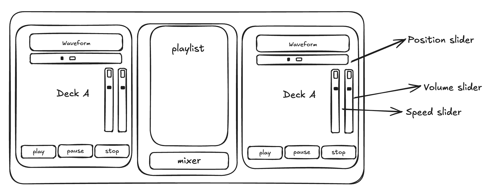
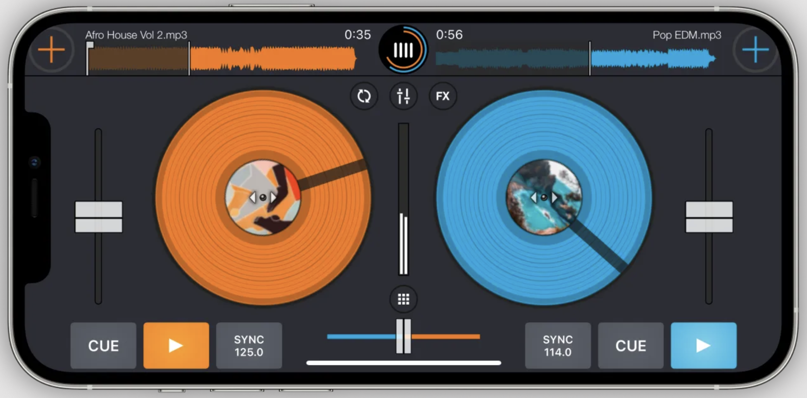

# How the program works (R1)
This project is a two-deck DJ audio application. Users can build a persistent playlist by loading audio tracks, then assign any track to Deck 1 or Deck 2. Each deck provides transport controls (Play, Pause, Stop) and sliders for playback speed, volume, and track position (scrub). Between the decks, a mixer exposes a master volume control and a crossfader that blends the two decks for smooth transitions—mirroring standard DJ workflows for cueing and mixing.

# How the music library was implemented and persisted (R2)
The PlayListComponent lets users load audio tracks via juce::FileChooser, constrained to *.mp3 and *.wav. Playlist persistence is handled with juce::ApplicationProperties, which stores each track’s metadata (title and absolute file path) so the list survives app restarts.

## Load & persist flow

- The user clicks Load track.
- The buttonClicked handler fires.
- A juce::FileChooser opens with the *.mp3;*.wav filter.
- After the user confirms a file, addTrack(const juce::File& file) is called.
- The track metadata is appended to the internal std::vector<Track>.
- savePlaylist() is invoked, which iterates over the vector and writes each track’s title and path to ApplicationProperties (via its PropertySet).
- On startup, loadPlaylist() reads from ApplicationProperties and repopulates the in-memory vector, restoring the user’s playlist.

# How I Customised the User Interface (R3)
Based on my research about other applications (more details will be in topic R4)
and based on what has been developed during this module I first created a wireframe
that contains the components and their corresponding functionalities.

With the layout clarified, I implemented it in JUCE using FlexBox (https://docs.juce.com/master/classFlexBox.html) and FlexItem (https://docs.juce.com/master/classFlexItem.html).
This approach let me organize the UI into rows and columns that resize cleanly, keep consistent spacing/alignment, and adapt well when the window is resized.
Also I found these tutorials explaining how layout UI using FlexBox:
- https://juce.com/tutorials/tutorial_flex_box_grid/
- https://www.youtube.com/watch?v=RzfUS_xnUnw

# Investigate and implement ONE new feature inspired by a real DJ program (R4)
I have investigated two DJ applications:
- DJ Music Mixer - DJ Mix Studio (https://cafebazaar.ir/app/dj.music.mixer.sound.effects?l=en)

- Cross DJ (https://www.mixvibes.com/cross-dj)

Both apps have similar UI. One feature they have in common is the crossfader, a slider that controls
the volume of both decks at the same time, which you can use to create smooth transitions from one deck to the other. I created the MixerComponent.h and MixerComponent.cpp that contains the UI logic for displaying the crossfader, this component receives a callback function that is invoked whenever the value of the crossfader changes. The MainComponent is initialising the MixerComponent and passing the callback function into that, this function is responsible for receiving the updated value of the crossfader and adjust the volumes of each deck accordingly. Additionally I added a master fader
as well, so we can increase or decrease the volume of the application as a whole and its implementation also relies on a callback function, similar to what I described for the crossfader.