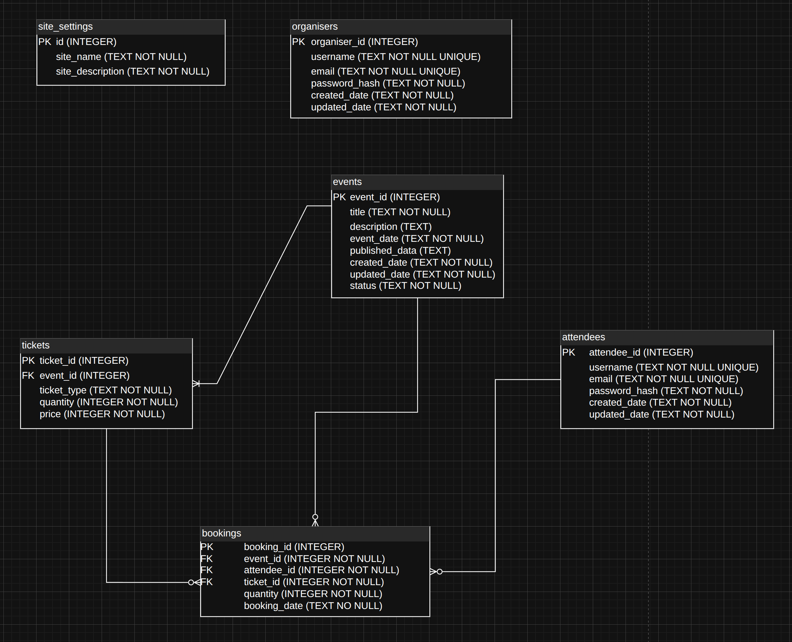

# Event Management System - Project Report

## 1. Architecture Overview

### Three-Tier Architecture

**Presentation Tier (Client)**  
- EJS templates rendering HTML/CSS  
- Browser-based user interface  
- Static assets served from `/public`  

**Application Tier (Server)**  
- Express.js web server (Node.js)  
- Route handlers (`*.route.js`)  
- Business logic actions (`*.action.js`)  
- View models (`*.view-model.js`)  
- Authentication middleware  

**Data Tier**  
- SQLite database (`database.db`)  
- Tables: events, tickets, bookings, attendees, organisers, site_settings  

### Key Endpoints

**Public Endpoints:**  
- `GET /` - Home page

**Authentication Endpoints:**  
- `GET/POST /auth/organiser/login` - Organiser authentication  
- `POST /auth/organiser/logout` - Organiser session termination   
- `GET/POST /auth/attendee/login` - Attendee authentication  
- `POST /auth/attendee/logout` - Attendee session termination    
- `GET /auth/attendee/signup` - Attendee registration page  
- `POST /auth/attendee/signup` - Create attendee account   

**Organiser Endpoints (Protected):**   
- `GET /organiser` - Dashboard  
- `GET /organiser/event/new` - Create new event  
- `GET/POST /organiser/event/edit/:id` - Event management  
- `POST /organiser/event/publish/:id` - Publish events  
- `POST /organiser/event/unpublish/:id` - Unpublish events  
- `POST /organiser/event/delete/:id` - Delete events  
- `GET /organiser/site-settings` - Site settings page  
- `POST /organiser/site-settings` - Update site settings  
- `GET /organiser/attendees` - **Extension: Attendee management**  
- `POST /organiser/attendees/toggle-special/:id` - **Extension: Toggle special status**  

**Attendee Endpoints:**  
- `GET /attendee` - Browse events  
- `GET /attendee/event/:id` - Event details with **dynamic ticket availability**  
- `POST /attendee/event/book/:event_id` - **Extension: Booking with concession validation**  
- `GET /attendee/my-bookings` - View bookings

**Extension Highlights:**    
- Session management for organisers and attendees  
- Protected routes with authentication middleware  
- Concession ticket access control for special attendees  
- Code modularization and separation of concerns  

---

## 2. Entity-Relationship Diagram

**Extension Elements Highlighted:**  
- `attendees.is_special` - Extension field enabling concession ticket access control  
- Foreign key relationships ensuring referential integrity  
- Normalized design separating tickets from events  
  
  

---

## 3. Extension Description

### 3.1 Extension Overview

The project implements four key extensions that enhance the base functionality:

1. **Session Management**: Separate authentication sessions for organisers and attendees
2. **Protected Routes**: Middleware-based route protection ensuring only authenticated users access restricted endpoints
3. **Concession Ticket Access Control**: Business rule restricting concession tickets to attendees marked as "special" by organisers
4. **Code Modularization**: Separation of concerns through organized file structure and naming conventions

### 3.2 Extension Details

#### Extension 1: Session Management

The application implements separate session management for organisers and attendees using Express sessions (`src/index.js`). Each user type maintains independent session state:  
- Organiser sessions store `organiserId` in `req.session.organiserId`  
- Attendee sessions store `attendeeId` in `req.session.attendeeId`  

Sessions are created upon successful login (`src/routes/auth.route.js`) and destroyed on logout, redirecting users to the home page. This enables stateful authentication without requiring users to re-authenticate on each request.

#### Extension 2: Protected Routes

Authentication middleware (`src/middleware/require-organiser-auth.js` and `src/middleware/require-attendee-auth.js`) protects routes by checking session state. Protected routes include:  
- All organiser endpoints (event management, site settings, attendee management)  
- Attendee booking viewing (`/attendee/my-bookings`)  

The middleware redirects unauthenticated users to their respective login pages, ensuring only authorized users can access protected functionality.

#### Extension 3: Concession Ticket Access Control

The system enforces a business rule that concession tickets can only be purchased by attendees with special status. Implementation includes:  

**Database Schema**: The `attendees` table includes an `is_special` field (`src/db_schema.sql`) that organisers can toggle.  

**Organiser Management**: Organisers can view all attendees and toggle their special status through `/organiser/attendees` (`src/routes/organiser.route.js`). The update action (`src/modules/attendee/update-attendee-special-status.action.js`) validates and updates the status.  

**Booking Validation**: When booking tickets (`src/routes/attendee.route.js`), the system validates that concession ticket requests come only from special attendees, returning a 403 Forbidden error if validation fails.  

**Dynamic Availability**: Ticket availability is calculated dynamically using SQL aggregation (`src/modules/tickets/get-tickets-by-event-id-list.action.js`) to compute booked quantities, preventing overbooking.  

#### Extension 4: Code Modularization

The codebase follows a clear separation of concerns through file naming conventions and directory structure:  

- **Actions** (`*.action.js`): Encapsulate business logic and database operations  
- **Routes** (`*.route.js`): Handle HTTP requests and coordinate actions  
- **View Models** (`*.view-model.js`): Structure data for view rendering  
- **Middleware**: Authentication and authorization checks  

This modularization improves code maintainability, testability, and follows SOLID principles by separating responsibilities.  

### 3.3 Course Content Application

**Database Techniques:**  
- **Foreign Key Constraints**: Enforced referential integrity between bookings, events, tickets, and attendees  
- **SQL Aggregation**: Used `SUM()` and `GROUP BY` to calculate booked quantities for dynamic availability  
- **LEFT JOIN**: Combined tickets with booking aggregates to compute real-time availability  

**Web Development Techniques:**  
- **Session Management**: Express sessions maintain authentication state across requests  
- **Server-Side Validation**: Business rules enforced at application tier before database operations  
- **HTTP Status Codes**: Proper use of 403 (Forbidden) for access control violations  

**Security Practices:**  
- **Password Hashing**: Bcrypt used for secure password storage  
- **Input Validation**: Zod schema validation for registration data  
- **SQL Injection Prevention**: Parameterized queries throughout all database operations  
- **Access Control**: Role-based authorization checks at route level  

### 3.4 Beyond Course Content

**Advanced Features Implemented:**  

1. **Multi-User Session Management**: Separate session handling for different user types (organisers and attendees) with independent authentication flows  

2. **Middleware-Based Route Protection**: Reusable authentication middleware that can be applied to any route, demonstrating the middleware pattern beyond basic Express usage  

3. **Business Rule Enforcement**: Server-side validation ensures concession tickets can only be purchased by special attendees, demonstrating domain logic implementation  

4. **Dynamic Availability Calculation**: Real-time ticket availability computed from bookings using SQL aggregation, preventing overbooking  

5. **Separation of Concerns**: Clean architecture with actions, routes, and view models separated, improving maintainability and testability  

6. **Modular File Organization**: Consistent naming conventions (`*.action.js`, `*.route.js`, `*.view-model.js`) that make code structure immediately understandable  

---

## Conclusion

The extensions successfully enhance the base application with session management, route protection, business rule enforcement, and code modularization. These features demonstrate understanding of database relationships, web application architecture, security practices, and software design principles. The implementation showcases advanced techniques covered in the course, including session management, middleware patterns, SQL aggregation, and separation of concerns, while maintaining clean, maintainable code structure.

